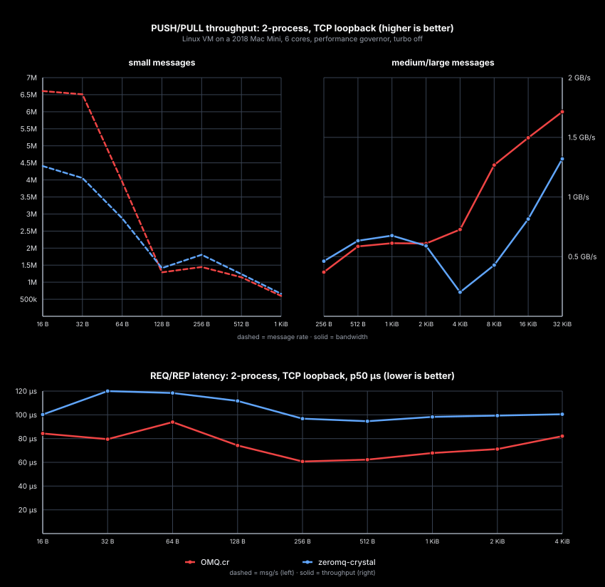

# OMQ.cr Development

## Shard Packaging

This shard is split from the OMQ.rs monorepo so `shard.yml` can live at the
repository root. Crystal Shards still assumes that layout for Git dependencies.
Track upstream monorepo shard support in
[crystal-lang/shards#635](https://github.com/crystal-lang/shards/issues/635).

Shard installs run `scripts/postinstall.sh`, which builds `omq-libzmq` and
copies the native library to `ext/lib`. The script uses `../omq.rs` when that
checkout exists, otherwise it clones OMQ.rs. Set `OMQ_RS_DIR=/path/to/omq.rs`
to override it.

Manual install step:

```sh
scripts/postinstall.sh
```

## Test

```sh
./scripts/test-crystal.sh
```

This builds `omq-libzmq`, checks Crystal formatting, and runs the Crystal
specs with the correct native library path.
By default it builds `../omq.rs`; set `OMQ_RS_DIR=/path/to/omq.rs` when the
Rust checkout lives elsewhere.

Manual equivalent:

```sh
(cd ../omq.rs && cargo build -p omq-libzmq)
export LIBRARY_PATH="$PWD/../omq.rs/target/debug:$LIBRARY_PATH"
export LD_LIBRARY_PATH="$PWD/../omq.rs/target/debug:$LD_LIBRARY_PATH"
crystal spec spec --link-flags "-L$PWD/../omq.rs/target/debug -Wl,-rpath,$PWD/../omq.rs/target/debug"
```

The spec suite covers basic API behavior, pyzmq interop, socket-type parity,
socket-option parity, draft sockets, poll/poller, monitor stubs, CURVE, Z85,
and stream raw TCP behavior.

## Benchmarks

Quick local chart:

```sh
scripts/update_perf.py --quick
```

Full local chart:

```sh
scripts/update_perf.py
```

The benchmark runner builds separate OMQ and zeromq-crystal peer binaries, so
`libomq_zmq` and system `libzmq` symbols cannot interpose on each other.
`zeromq-crystal` is used through its `LibZMQ` FFI layer because the high-level
socket wrapper does not compile on Crystal 1.21.

Rows append to `~/.cache/omq.cr/bindings.jsonl`. The chart is written to
`doc/charts/bindings.svg`.



Default measurement settings:

- Throughput: 3 measured rounds, 2.5 s per round, 0.5 s per-round warmup.
- Latency: 3 measured rounds, 1.5 s per round, 0.5 s per-round warmup.
- Cell result: median measured round by `msg/s` for throughput and median
  measured round by p50 latency for latency.
